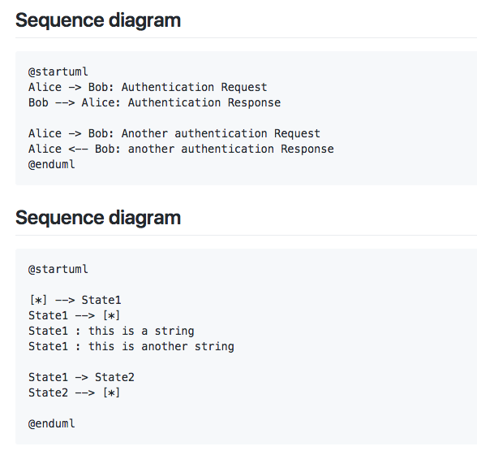
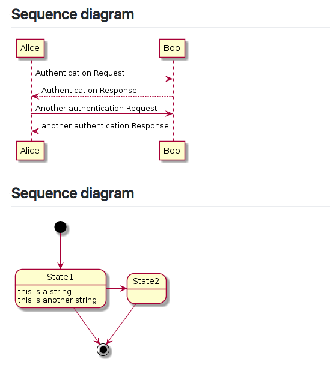

# Pegmatite - Chrome ext to preview PlantUML in markdown

Pegmatite is Google Chrome extension that replace PlantUML code blocks into preview images.

[Chrome web store](https://chrome.google.com/webstore/detail/pegmatite/jegkfbnfbfnohncpcfcimepibmhlkldo)

## Summary

| You will see below               | But we see
| -------------------------------- | -------------
|  | 

- This extension is enabled only in the whitelisted sites.
    - `https://github.com/*`
    - `https://gist.github.com/*`
    - `https://gitpitch.com/*`
- Replace only code block with lang `uml` and starts with `@start`
- When the element is double-clicked, element will toggle original code block and preview image.

## Sample contents

### Sequence diagram

```uml
@startuml
Alice -> Bob: Authentication Request
Bob --> Alice: Authentication Response

Alice -> Bob: Another authentication Request
Alice <-- Bob: another authentication Response
@enduml
```

### Sequence diagram

```uml
@startuml
[*] --> State1
State1 --> [*]
State1 : this is a string
State1 : this is another string

State1 -> State2
State2 --> [*]
@enduml
```

### Other code blocks

These cannot preview.

#### Code block without lang `uml`

```
@startuml
Foo -> Bar
@enduml
```

#### `uml` code block does not starts with `@start`

```uml
foo
bar
baz
```

## Using another PlantUML server

By default, Pegmatite uses [PlantUML server](https://github.com/plantuml/plantuml-server) 
deployed to `https://www.plantuml.com/plantuml`.

However, if your UML is confidential and you cannot send it to an external server, you can also use any PlantUML server.
Configuring "Base URL" on the setting page, Pegmatite delegates image generation to this server.

Examples.

- `https://www.plantuml.com/plantuml/img/` (default)
- `https://www.plantuml.com/plantuml/svg/`
- `https://any-plantuml-server.example.com:8080/img/`

Also you can run PlantUML server in localhost using Docker as following command:

```
$ docker run -d -p 8080:8080 plantuml/plantuml-server
```

And you can specify `http://localhost:8080/img/` as "Base URL".

Note: To avoid mixed-content, if the "Base URL" is not HTTPS scheme,
generated image is converted to [DATA URI](https://tools.ietf.org/html/rfc2397).

## Contribution

1. Fork ([https://github.com/dai0304/pegmatite/fork](https://github.com/dai0304/pegmatite/fork))
1. Create a feature branch named like `feature/something_awesome_feature` from `development` branch
1. Commit your changes
1. Rebase your local changes against the `develop` branch
1. Create new Pull Request

## Author

[Daisuke Miyamoto](https://github.com/dai0304)
